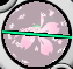

# introdução

oi, Sera aqui~  
vamos falar de quebras - como elas funcionam e o efeito que elas tem na bola.

aqui NÃO vou ensinar a contar quebras, mas só para não passar batido, recomendaria mycella para a maioria ;p (alinha para deixar o máximo de quebras, conta a quebra máxima, daí volta ao ponto mira e multiplica a quebra máxima pela diferença de ângulo)

# componentes da quebra

como "todos" já sabem a essa altura, a quebra possui uma componente-x (horizontal) e uma componente-y (vertical).  
alguns exemplos a seguir (valores de acordo com acesso à memória do jogo, visualização da s4):

|  |  |  |
|-------------|-------------|-|
| **0.08x, 0.00y** | **0.00x, 0.08y** | **0.08x, 0.08y** |

# componente-y

vamos começar pelas boas notícias: a componente-y é COMPLETAMENTE irrelevante para o cálculo.  
ela não influencia nem na força (vídeo):

[](https://www.youtube.com/watch?v=Yw9XEveIh8w)  
(a pequena diferença no resultado é porque a mira não ficou perfeitamente alinhada para todas as tacadas, então tem uma componente-x microscópica na quebra)

portanto, o exemplo que diz **0.00x, 0.08y** é calculado de forma exatamente igual a 0 quebras. então, o que a componente-y faz?  
quando você gira para o lado, as quebras-y vão virar quebras-x, e as quebras-x vão virar quebras-y. se você girar 90 graus, vai inverter quebra-x e quebra-y :o  
em termos práticos, a componente-y também pode atrapalhar bastante na visualização ;(

# componente-x

então, toda a influência da quebra na tacada vem da componente-x.  
a componente-x da quebra SEMPRE vai influenciar tanto no desvio quanto na força (portanto, se o seu cálculo não desconta nada da distância real de acordo com as 
quebras, está errado).

assim como o vento, a quebra influencia a trajetória da bolinha durante todo o tempo em que a bolinha está no ar.

## influência da quebra no desvio

a fórmula que eu uso para calcular a influência da quebra no desvio é:

``componente-x da quebra * hwi final * % * constante``

**componente-x da quebra:** é o que muitos chamam de "quebra real", contada do jeito que você (ou a calc) quiser.  
pode usar escala visual ("normal"), escala pixel, escala da memória do jogo ou seja lá o que for, desde que a escala utilizada seja a mesma em todos os lugares do cálculo.

**hwi final:** influência do vento usada na tacada, depois de descontar a influência da altura e tal.

**%:** é a porcentagem da força que vai usar na tacada.  
por exemplo, se vai mandar usando 94% da força, multiplica por 0.94

**constante:** é um número que depende do taco e da escala. basicamente, a ideia é que essa constante vai relacionar o valor da quebra com o valor do hwi.  
portanto, se você conta em pixel, você vai usar uma constante diferente de quem conta na escala visual (mas, no final do cálculo, o resultado final na mira deve ser o mesmo).  
essa constante varia de acordo com a tacada e a força do taco - por exemplo, o valor da constante do 3w vai ser menor do que a do 2w, e a constante do dunk 1w 334y vai ser maior do que a do dunk 1w 266y.

## influência da quebra na força

a influência de cada quebra na força também vai ser menor conforme o taco, tacada e %.  
as quebras SEMPRE vão ter o efeito de mandar a bolinha mais longe 👀

também há uma variação beeeeem pequena na influência de cada quebra de acordo com a quantidade de quebras - quanto mais quebras, menor a influência de cada uma na força.  
por exemplo, para dunk 1w 332 20spin 100% a primeira quebra desconta 0.075y da distância, mas se forem 10 quebras, cada quebra vai valer só ~0.068y :o

a margem de erro permitida para o cálculo da força é razoavelmente grande, então não pesquisei tanto a respeito disso.  
o importante é saber que esse efeito existe~


## exemplo

**vídeo**  
[](https://www.youtube.com/watch?v=uTjE33t8kxc)

### primeira parte: mycella (para descobrir a componente-x)
~16.1 quebras em escala visual season 4  
diferença de ângulo entre quebra alinhada e ponto mira: aproximadamente 62.7

``quebra real = 16.1 * cos 62.7`` ``= 7.4 componente-x``

### segunda parte: componente-x da quebra * hwi final * % * constante
``7.4 * 1.02 * 0.9278 * 0.3321`` ``= 2.331y``  
no caso, essa constante (0.3321) serve para essa escala que eu usei. se contar por pixel, tem que usar outro número...

boa sorte -.( ' ~ ' ).- depois não esquece também de adicionar o resultado do vento, claro  
se tiver dúvidas azar, é isso aí

## e aí?

tem muita coisa errada circulando por aí.  
vamos falar de "geradores de quebra":
- geradores não deveriam existir. essas correções que muitos players usam gerador para fazer - descontar a distância real por causa das quebras, e descontar a inf da quebra por causa da % - deveriam ser feitas em TODOS os cálculos (em outras palavras, edite a calculadora, boa sorte)
- ainda falando de geradores, o valor que você deve descontar da distância real é apenas baseado na componente-x ("quebra real"). a maioria usa a quebra máxima, o que está errado

geradores são uma gambiarra feita pelos players para corrigir erros da base das calculadoras, muitas das quais são antigas (feitas em tempos em que não era possível verificar com precisão esses efeitos, a maioria nem sabia que eles existem).

quando você junta uma gambiarra em cima da outra, só vai conseguir acertar casos de muitas quebras (tipo, 10+) na sorte ou decorando.  
fórmulas erradas nas calcs são uma fonte grande de inconsistências nos dados - todo mundo das antigas deve lembrar de casos clássicos em que A MESMA QUEBRA valia, por exemplo, "2.0 para dunk, 1.8 para tomahawk" (ainda dá para ver dessas nos guias por aí), e tinha até casos piores de dorgas em que diziam "o valor da quebra muda para vento alto".  
é óbvio que a quebra sempre é a mesma, então, de onde é que vem o problema? das fórmulas usadas nas calculadoras.

falo isso não para desmerecer os esforços dos nossos antepassados, muito pelo contrário, eu também estava lá~  
era MUITO mais difícil de fazer ciência nos tempos antigos, então era quase impossível investigar a fundo essas coisas. mas, agora que nós já entendemos mais do jogo, é hora de revisar as bases dos cálculos para não sofrer mais com esses velhos problemas de dados inconsistentes <3


## BONUS: funcionamento real das quebras na memória

eu zerei a componente-x ou componente-y nas prints iniciais só para fins de exemplo.

de fato, há dois valores na memória que dizem respeito às quebras. porém, ambos os valores possuem uma componente-x e uma componente-y, de acordo com a diferença de ângulo entre a nossa mira e o ponto-zero do hole.

**importante:** o ponto-zero do hole é uma referência definida pelos criadores do mapa quando criaram o hole, raramente vai estar em cima do pin. então, essa diferença de ângulo NÃO é o ângulo do vento que nós colocamos na calc, e infelizmente não tem como encontrar de forma trivial sem comando gm ou acesso à memória T_T

muitos chamam `v1` de `slope x` e `v2` de `slope y`, mas eu não gosto desses nomes, porque os dois valores tem componente-x e componente-y de acordo com nossa mira.  
provavelmente é mais fácil entender com um exemplo:

```
v1: 0.042  v2: 0.134     diferença de ângulo: 71.9

v1x: v1 * cos(a)   |   0.04 * 0.31 = 0.013
v1y: v1 * sin(a)   |   0.04 * 0.95 = 0.040
v2x: v2 * sin(a)   |   0.13 * 0.95 = 0.127
v2y: v2 * cos(a)   |   0.13 * 0.31 = 0.042

vx: (v1x+v2x) * 100 | (0.013+0.127) * 100 = 14.0
vy: (v1y+v2y) * 100 | (0.040+0.042) * 100 = 8.2
```

para mais exemplos, assista meu vídeo de auto-slope :o https://www.youtube.com/watch?v=l6VGsviUL1M

aí já tem tudo o que precisa saber para fazer seu próprio auto-slope para usar em servers que, por algum motivo misterioso, permitem essa libertinagem de acesso à memória (como o pangyabr).  
se quiser fazer algum helper e publicar free, tem meu apoio moral (mas não tenho tempo de ajudar pessoalmente, sorry)
